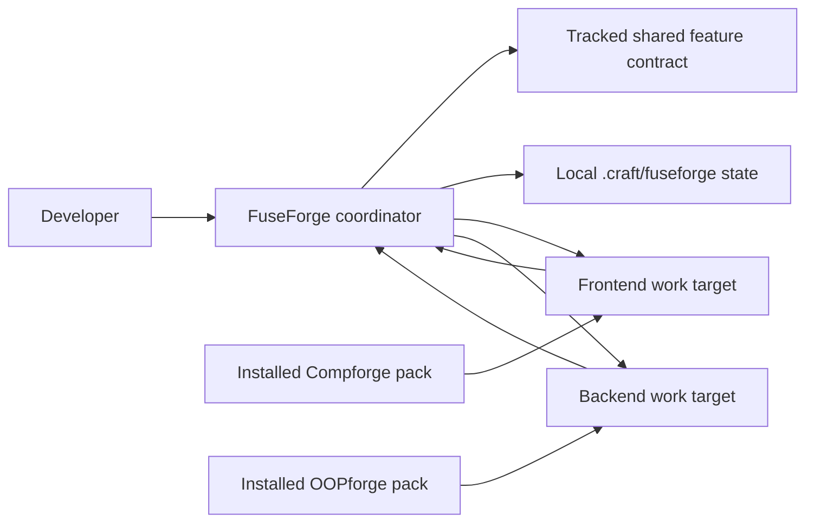

# FuseForge — Coordinator Design

- Status: Approved for Delivery Plan
- Date: 2026-08-26
- Approved: 2026-08-26
- Input: Approved `docs/planning/checkpoints/discovery.md`

## 1. Design scope

This Design defines the smallest coordinator contract needed to keep
Compforge and OOPforge aligned during one product-level workflow.

It defines:

- the boundary between installed methodology packs and product workspaces;
- the logical workspace and shared feature contract;
- contract revision, track result, staleness, and stage-barrier rules;
- specialist delegation and return interfaces;
- the default user flow and harness-facing entry points;
- the minimum connected verification owned by FuseForge;
- the calendar product semantics needed by Delivery Planning;
- the future sibling-aligned harness structure.

It does not create a skill, manifest, installer, CI workflow, reference
application, or calendar implementation. Those remain subject to Delivery Plan
and Skeleton checkpoints.

## 2. System context

FuseForge is a policy coordinator. It does not contain frontend component
discipline or backend OOP/DDD discipline.



Dependency direction is inward toward the approved product contract:

1. harness adapters invoke FuseForge policy;
2. FuseForge policy owns shared semantics and coordination state;
3. specialist packs consume shared semantics and own track-local design;
4. product source code remains in its frontend and backend work targets.

No specialist pack may invoke the other or silently change shared semantics.

## 3. Packs and product workspaces

### 3.1 Installed packs

The methodology packs are installed once per developer environment:

```text
~/.fuseforge
~/.compforge
~/.oopforge
```

An installed pack is not a product workspace and must not collect state for
unrelated products.

FuseForge setup will eventually:

1. install Compforge or OOPforge only when that pack is missing;
2. preserve an existing installation;
3. inspect existing versions and capabilities for compatibility;
4. report an incompatible installation instead of replacing or updating it
   silently.

Automatic installation is an explicit bootstrap/install action. Ordinary
`craft` execution must not update the developer environment.

### 3.2 Polyrepo product workspace

The preferred polyrepo arrangement has three independent repositories:

```text
product-coordination/   # shared contract and product-stage documents
product-frontend/       # frontend source
product-backend/        # backend source
```

The coordination repository is the coordination root. It does not contain the
frontend or backend source and does not imply atomic commits across the three
repositories.

### 3.3 Monorepo product workspace

For a monorepo, the repository root is both the coordination root and the Git
root:

```text
product/
  docs/features/
  frontend/
  backend/
```

The frontend and backend directories remain separate work targets. Parallel
specialist work is allowed only when declared write roots do not overlap.

### 3.4 Logical workspace

A logical workspace is the topology-neutral coordinator view:

| Field | Meaning |
|---|---|
| `coordination_root` | Product coordination repository or monorepo root |
| `feature_id` | Stable product-language feature identifier |
| `context` | `greenfield` or `existing` |
| `intent` | `feature`, `bug-fix`, or `refactor` |
| `topology` | `monorepo` or `polyrepo` |
| `frontend_target` | Frontend path, or absent when not required |
| `backend_target` | Backend path, or absent when not required |
| `required_tracks` | `frontend`, `backend`, or both |
| `write_roots` | Track-owned writable paths |
| `base_revisions` | Per-target Git revision recorded at delegation |
| `pack_versions` | Loaded FuseForge, Compforge, and OOPforge versions |
| `harness` | Active Claude, Codex, Cursor, or other verified adapter |

Absolute work-target paths are local coordinator state. They do not belong in
the tracked shared contract.

## 4. User-facing coordinator contract

### 4.1 Public entry points

FuseForge exposes two product intents:

- `craft` — classify, plan, coordinate, and eventually execute product work;
- `consult` — answer, compare, review, or write one explicitly requested
  planning document without implementation changes.

Expected harness forms are:

| Harness | Craft | Consult |
|---|---|---|
| Claude Code | `/fuseforge:craft …` | `/fuseforge:consult …` |
| Codex CLI | `Use FuseForge craft: …` | `Use FuseForge consult: …` |
| Cursor Agent | `Use FuseForge craft: …` | `Use FuseForge consult: …` |

`refactor` and `test` are not separate FuseForge commands. `craft` classifies
the work intent and routes to the appropriate Compforge or OOPforge workflow.
`consult` never performs implementation.

### 4.2 Default request flow

1. Accept one product-language request.
2. Inspect enough workspace context to classify context, intent, topology, and
   required tracks.
3. Verify installed specialist capabilities and activation.
4. Ask one combined stack question when any required stack is unspecified.
5. Draft or load the shared feature contract.
6. Delegate the current stage to required specialists.
7. Combine valid track results into one product-language checkpoint.
8. Advance only after user approval.

An unaffected track is not activated merely to preserve symmetry.

### 4.3 Stack ambiguity

Stack selection is never silent:

- ask for both missing stacks in one user turn;
- show only capabilities reported by loaded compatible packs;
- explain only the trade-off that changes the choice;
- do not offer planned capabilities such as Vue before the specialist pack
  actually supports them;
- for one-sided work, ask only for the required track's stack.

### 4.4 Existing-project inspection

Inspection expands progressively:

1. inspect the affected feature, contract, and call paths;
2. when the necessary scope appears broader, tell the user what was found and
   confirm that interpretation;
3. inspect the whole repository architecture only if the answer remains
   ambiguous or the dependency cannot otherwise be established.

This rule limits tokens and drive-by redesign without permitting an uninformed
small change.

## 5. One source of truth

### 5.1 Shared feature contract

The authoritative cross-stack artifact is tracked in the product coordination
root:

```text
docs/features/<feature-slug>/contract.md
```

It contains only:

- feature identity, revision, and approved scope;
- product-language flows and acceptance examples;
- API operations, schemas, errors, and authentication meaning;
- time, locale, ordering, idempotency, and concurrency rules when relevant;
- backend outcome to frontend state mapping;
- evidence ownership;
- unresolved product decisions.

OpenAPI may be linked or generated as a wire projection. It is not a
replacement for product behavior, UI-state mapping, or acceptance examples.

### 5.2 Artifact ownership

| Artifact | Owner | Authority |
|---|---|---|
| Shared feature contract | FuseForge parent | Cross-stack product and wire semantics |
| Compforge stage artifact | Frontend specialist | Frontend component and state design |
| Component Contract | Compforge | Frontend execution boundary |
| OOPforge stage artifact | Backend specialist | Domain, use-case, port, and transaction design |
| OOP Contract | OOPforge | Backend execution boundary |
| Integrated checkpoint | FuseForge parent | Human approval of the combined stage |

Specialist artifacts must reference the delegated shared-contract revision.
They may propose a shared change through a decision request but may not edit the
authoritative contract directly.

## 6. Contract revision and staleness

The shared contract uses a human-readable monotonic revision:

```text
rev-1
rev-2
rev-3
```

Only the parent increments it. A revision changes when approved product or wire
semantics change. Editorial changes that do not alter meaning do not require a
new revision.

A track result is stale when:

1. its contract revision differs from the current shared-contract revision; or
2. during Implement or Test, its recorded work-target base revision no longer
   matches the code revision on which the result depends.

A missing or incompatible specialist pack blocks delegation before work
begins. It does not create a stale result.

When a revision changes, affected results become stale while their artifacts
and evidence remain available. FuseForge requests only the revalidation needed
for the changed semantics.

## 7. Coordinator state and continuity

### 7.1 Local coordinator state

The coordination root stores local, gitignored state under:

```text
.craft/fuseforge/
  task-<feature-slug>.md
  next-session-prompt.md
```

The task document records:

- logical workspace snapshot;
- current stage and contract revision;
- pack versions and activation evidence;
- required tracks and write roots;
- each track's latest valid result reference;
- current blocker or pending user decision.

`next-session-prompt.md` contains one next decision in product language. It is
not a second contract or a permanent audit log.

### 7.2 Specialist state

Frontend and backend targets retain their own pack-managed `.craft/` state.
FuseForge links to those task documents but does not merge or rewrite them.

On resume, FuseForge:

1. loads `.craft/fuseforge/next-session-prompt.md`;
2. reloads the tracked shared contract;
3. checks contract and code revisions;
4. marks invalid results stale;
5. presents one integrated Resume summary;
6. continues only after user confirmation.

The tracked shared contract is authoritative for meaning. Local coordinator
state is authoritative only for session progress.

## 8. Specialist interfaces

### 8.1 Delegation envelope

Every specialist request includes:

| Field | Meaning |
|---|---|
| `track` | `frontend` or `backend` |
| `stage` | Current approved workflow stage |
| `intent` | `feature`, `bug-fix`, or `refactor` |
| `work_target` | Exact repository or directory |
| `write_roots` | Allowed writable paths; empty for advisory work |
| `contract_ref` | Shared contract path |
| `contract_revision` | Revision at delegation |
| `base_revision` | Target Git revision when relevant |
| `expected_output` | Stage artifact, contract, evidence, or decision request |

The prompt uses the harness-specific specialist entry form and verifies the
pack activation probe before relying on the result.

### 8.2 Track result envelope

Every returned result contains:

| Field | Meaning |
|---|---|
| `track` | Result owner |
| `stage` | Stage completed or attempted |
| `status` | `completed`, `decision_required`, `failed`, `cancelled`, or `stale` |
| `contract_revision` | Revision actually used |
| `base_revision` | Code revision actually inspected or changed |
| `artifacts` | Specialist stage artifact and execution-contract references |
| `evidence` | Track-owned checks and outcomes |
| `decision_requests` | Proposed shared changes requiring parent handling |
| `scope_drift` | None or explicit unexpected work |
| `remaining_risks` | Track-local unresolved risks |
| `product_summary` | Short user-facing outcome |

FuseForge adds coordination metadata around existing specialist outputs; it
does not replace their contract formats.

## 9. Ownership and escalation

The parent may resolve implementation choices that preserve approved observable
behavior. It must return to the user when a decision changes:

- user-visible behavior or flow;
- accepted data meaning;
- error meaning or recovery behavior;
- acceptance criteria;
- approved scope.

The parent may resolve without another user question:

- component or aggregate structure owned by a specialist;
- equivalent wire naming that does not change meaning;
- test organization;
- sequential versus parallel execution;
- retrying a failed track with the same contract.

Wire or UI-state conflicts first return to the parent. They reach the user only
when resolving them changes observable behavior.

## 10. Stage barrier

The barrier is closed when any required track:

- has no result;
- reports `decision_required`, `failed`, or `cancelled`;
- used an older contract revision;
- is invalidated by a relevant code revision change.

The barrier becomes ready for approval when:

- all required tracks report `completed`;
- all results use the current contract revision;
- write-root and scope checks pass;
- the parent has one combined product-language summary;
- required track evidence is attached.

The barrier opens only after the user approves that integrated summary.
Rejection preserves valid artifacts and returns the stage to the smallest
necessary correction. A failed track may retry without rerunning unrelated
valid work.

Parallel work is optional and requires a stable contract plus disjoint write
roots. Sequential delegation must always remain valid.

Focused bug fixes and refactors use the smallest specialist workflow. They
still require a FuseForge checkpoint when both tracks participate or shared
semantics are involved.

## 11. Connected verification

FuseForge owns one minimum connected check per implemented vertical slice:

> The real frontend API client calls a running backend and verifies the
> approved request, response, and error meaning.

This check:

- uses the actual frontend transport/client boundary;
- uses the actual backend HTTP adapter;
- proves at least one accepted product flow;
- records the shared-contract revision;
- complements rather than replaces frontend and backend specialist tests.

OpenAPI validation alone is insufficient because it cannot prove behavioral or
UI-state mapping. Browser-driven E2E, deployment, and production-readiness work
are separate opt-in scopes.

## 12. Future harness boundary

The Skeleton should resemble Compforge and OOPforge while containing only
coordinator-owned policy:

```text
skills/
  SKILL.md
  workflow/
    craft.md
    consult.md
  coordination/
    shared-contract.md
    logical-workspace.md
    delegation.md
    stage-barrier.md
    connected-verification.md
commands/
  craft.md
  consult.md
.claude-plugin/
.codex-plugin/
.cursor-plugin/
scripts/
  setup/
  ci/
docs/
```

The canonical policy lives under `skills/`. Commands and manifests are thin
harness adapters. Setup and verification scripts are outer adapters.

The future activation contract is expected to distinguish FuseForge from its
specialists:

```text
FUSEFORGE_ACTIVATION_PROBE
FUSEFORGE_LOADED
Assumptions
Shared Feature Contract
```

The exact files, manifests, scripts, and probe assertions belong to Skeleton
and Delivery Plan. This Design does not create them.

Specialist methodology trees, stack skeletons, architecture lint rules,
templates, and specialist test commands remain outside FuseForge.

## 13. Calendar product contract

### 13.1 Stack selection

No stack is selected silently. Before Delivery Planning, the user selects:

- one frontend stack supported by the loaded Compforge version;
- one backend stack supported by the loaded OOPforge version.

The local database follows the backend choice, such as H2 for Java Spring.

### 13.2 Product concepts

| Concept | Meaning |
|---|---|
| Schedule | Title, start, end, location, notes, calendar, recurrence, and reminder |
| Calendar | Internal grouping with a name and color |
| Recurrence | Weekly or yearly repetition of one schedule series |
| Reminder | Foreground in-app notice before a schedule begins |
| Application timezone | One configurable display timezone for the whole application |

### 13.3 Product behavior

The approved example supports:

- schedule create, read, update, and delete;
- year, month, week, and day views;
- internal calendars or categories distinguished by color;
- weekly and yearly recurrence;
- in-app reminders while the application is open.

Recurring schedule edits and deletions apply to the whole series. Per-occurrence
exceptions are deferred.

The backend persists instants in UTC. API responses intended for display use
the configured application timezone and include an explicit offset. The
frontend displays that value without applying a second implicit conversion.
The initial default is KST, and the application timezone is configurable.

The first proof excludes:

- external calendar-provider accounts and synchronization;
- background, email, or push notification delivery;
- per-user timezone preferences;
- per-occurrence recurrence exceptions;
- production deployment and operations.

### 13.4 Cross-stack states and errors

The shared contract must map backend outcomes to at least:

- loading;
- empty;
- saved;
- validation error;
- not found;
- reminder due;
- retryable connection error;
- non-retryable request error.

Invalid time ranges, unsupported recurrence values, missing calendars, and
malformed input are explicit contract errors rather than track-local guesses.

## 14. Delivery Plan handoff candidates

Delivery Planning may refine this order after the user selects stacks and
topology:

1. Schedule CRUD with month view and one default calendar.
2. Multiple internal calendars and color distinction.
3. Week, day, and year views over the same stored schedules.
4. Weekly and yearly recurrence with whole-series editing.
5. Foreground in-app reminders.
6. Deliberate mismatch, stale revision, failed-track retry, and clean-resume
   proof scenarios.

Each slice must be independently reviewable and include one real
frontend-client-to-backend connected check. Delivery Planning may split a slice
further but must not combine these into one unreviewed implementation.

Inputs still selected during Delivery Planning:

- frontend and backend stacks;
- monorepo or three-repository product topology;
- exact local database;
- final slice order and acceptance examples;
- commands and evidence used to verify each slice.

## 15. Design checkpoint — approved 2026-08-26

The maintainer approved:

- the installed-pack versus product-workspace boundary;
- the monorepo and three-repository logical-workspace mappings;
- the tracked shared contract and local `.craft/fuseforge/` split;
- the `rev-N` and stale-result rules;
- specialist delegation, result, ownership, and escalation interfaces;
- the integrated stage barrier;
- the real frontend-client-to-backend connected verification boundary;
- the `craft` and `consult` public interface;
- missing-only specialist auto-install policy;
- the sibling-aligned future harness boundary;
- the calendar semantics, exclusions, and Delivery Plan handoff candidates.

This approval authorizes Delivery Planning only. It does not authorize Skeleton
or implementation files.
